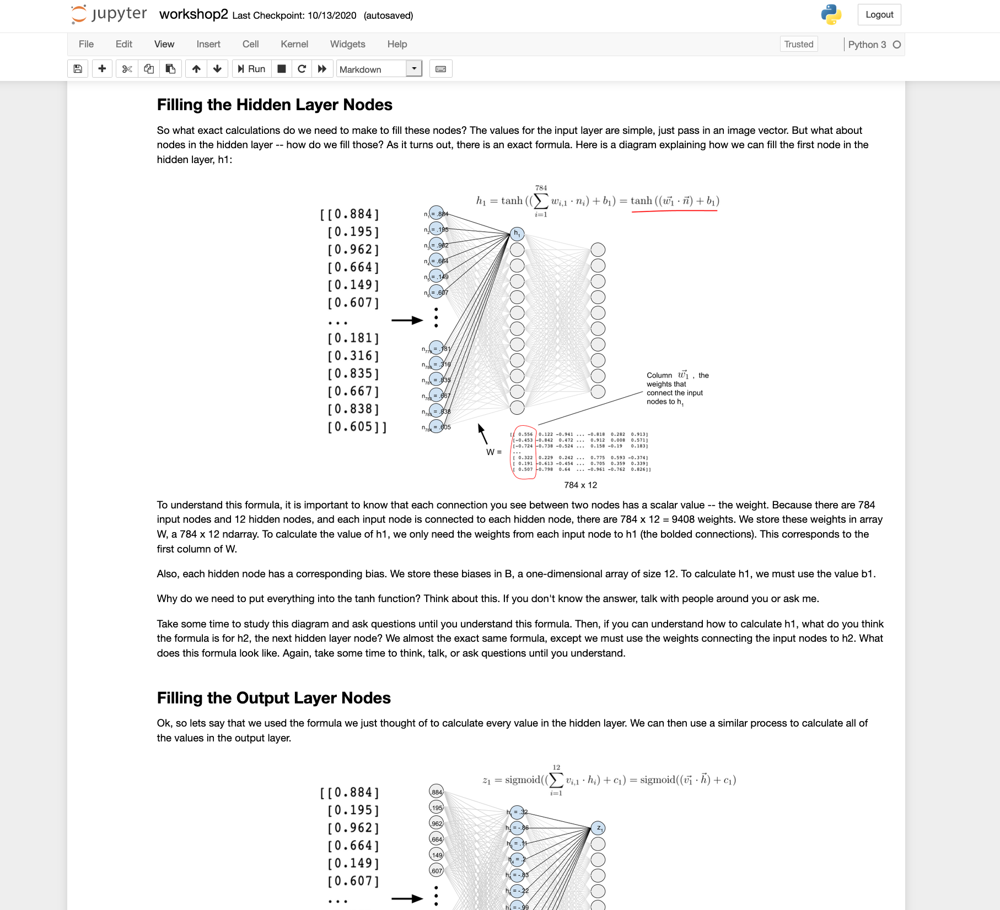
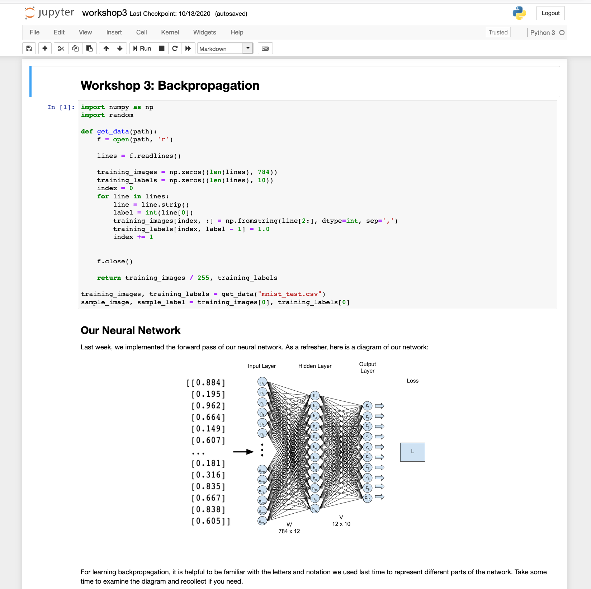

  

# About

Hello! This is a series of "workshops" from designed to give a gentle introduction to deep learning. Each workshop is a jupyter notebook that walks through some concepts and provides coding exercises along the way to test your knowledge. Learning about neural networks is not easy, so we include detailed diagrams and explanations to make learning as smooth as possible. We have also included answer keys to check your implementations. These will walk you through implementing a basic neural network from scratch (without an ML framework), and then learning the basics of using ML frameworks (PyTorch).

  
  

Feel free to work through these workshops alone, or come visit [Agency tuesday meetings](https://gtagency.github.io/) for any questions or explanation. We hold an open session where members can work through the workshops, and Agency officers will help with any question, ranging from installation of the workshops to providing in-depth explanations of neural network topics. We may also walk through a particular worksheet depending on the level of interest on the day. It is very much a relaxed, but productive learning environment.

# Installation

Simply fork the repository or download a zip of the code . It is important to keep all the workshops in the correct folder, otherwise images won't load properly.
Check requirements.txt

